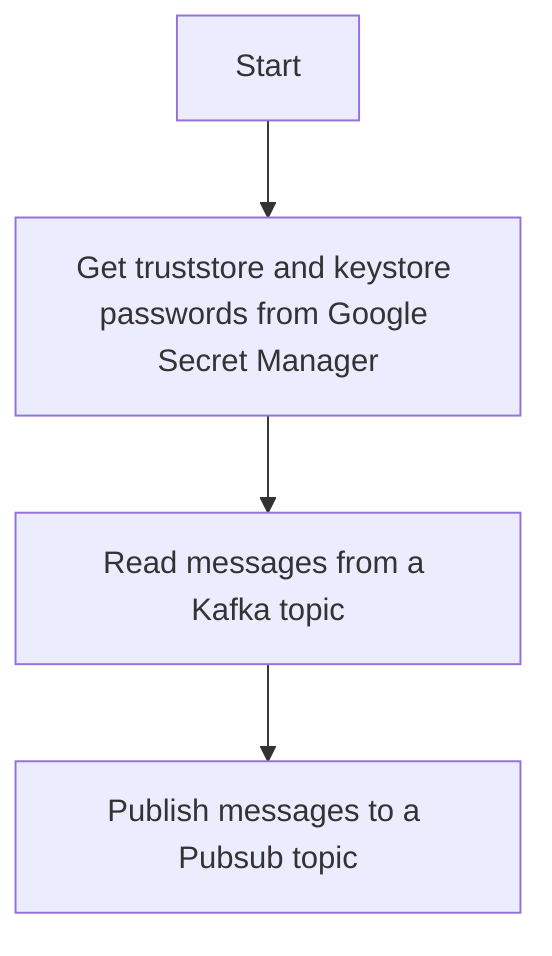

# Kafka2Pubsub
This is a simple Kafka to Pubsub bridge. It reads messages from a Kafka topic and publishes them to a Pubsub topic. Written in Java and Apache Beam, uses the native KafkaIO and PubsubIO connectors, deployed on Google Cloud Dataflow.

## Overall approach
0. Get truststore and keystore passwords from Google Secret Manager.
1. Read messages from a Kafka topic using the KafkaIO connector.
2. Publish messages to a Pubsub topic using the PubsubIO connector.
3. Use the Direct Runner for local development and the Dataflow Runner for production deployment.

Mermaid diagram:


Note: When running on Google Cloud Dataflow, the truststore and keystore files need to be present on a /secrets directory in the worker VMs. The files are copied into the docker image at build time. We are working on improving this process to fetch these files at runtime from Google Secret Manager.

## How to run
### Local development (via Direct Runner)

```bash
BOOTSTRAP_SERVERS=[KAFKA_BOOTSTRAP_SERVERS] # e.g. localhost:9092
TOPIC=[KAFKA_TOPIC] # Kafka topic to read from e.g. my-topic
PUBSUB_TOPIC=[PUBSUB_TOPIC] # Full Pubsub topic path to publish to e.g. projects/my-project/topics/my-topic
TRUSTSTORE_LOCATION=[TRUSTSTORE_LOCATION] # Path to the truststore file (local to the machine / worker)
TRUSTSTORE_PASS_SECRET_ID=[TRUSTSTORE_PASS_SECRET_ID] # Secret Manager secret ID for the truststore password 
KEYSTORE_LOCATION=[KEYSTORE_LOCATION] # Path to the keystore file (local to the machine / worker)
KEYSTORE_PASS_SECRET_ID=[KEYSTORE_PASS_SECRET_ID] # Secret Manager secret ID for the keystore password
SECRET_MANAGER_PROJECT_ID=[SECRET_MANAGER_PROJECT_ID] # GCP project ID where the secrets are stored

mvn compile exec:java \
    -Dexec.mainClass=org.apache.beam.samples.MainPipeline \
    -Dexec.args="--runner=DirectRunner \
        --kafkaBootstrapServers=${BOOTSTRAP_SERVERS} \
        --kafkaTopic=${TOPIC} \
        --pubsubTopic=${PUBSUB_TOPIC} \
        --sslTruststoreLocation=${TRUSTSTORE_LOCATION} \
        --sslTruststorePassSecretId=${TRUSTSTORE_PASS_SECRET_ID} \
        --sslKeystoreLocation=${KEYSTORE_LOCATION} \
        --sslKeystorePassSecretId=${KEYSTORE_PASS_SECRET_ID} \
        --secretManagerProjectId=${SECRET_MANAGER_PROJECT_ID} \
        --sslEndpointIdentificationAlgorithm=" # Optional: e.g. https"
```

### Building the container image

In order for the Dataflow Runner to work, we need to build the container image copy in the secrets related to the truststore and keystore files and push it to Google Container Registry. Below is an example of how to build the container image:

```bash
# Fetch the trustsore and keystore files from Google Cloud Storage
gsutil cp gs://[BUCKET_NAME]/[TRUSTSTORE_FILE] ./secrets/truststore.jks
gsutil cp gs://[BUCKET_NAME]/[KEYSTORE_FILE] ./secrets/keystore.jks

# Build the container image and push it to Google Container Registry
gcloud builds submit --tag [REGION]-docker.pkg.dev/[PROJECT_ID]/[REPO_NAME]/[IMAGE_NAME] .
```

The above steps can as well be automated via a Cloud Build pipeline and a trigger.

### Launching from Uber Jar

First step is to build the Uber Jar:

```bash
mvn clean package
```

Then, launch the Dataflow job:

```bash
java -cp target/kafka2pubsub-1.0-SNAPSHOT.jar  \
    org.apache.beam.samples.MainPipeline \
    --runner=DataflowRunner \
    --project=[PROJECT_ID] \
    --gcpTempLocation=gs://[BUCKET]/tmp/ \
    --stagingLocation=gs://[BUCKET]/staging/ \
    --region=[REGION] \
    --kafkaBootstrapServers="[KAFKA_BOOTSTRAP_SERVER]" \
    --kafkaTopic=[KAFKA_TOPIC] \
    --pubsubTopic="[PUBSUB_TOPIC]" \
    --sslTruststoreLocation="/secrets/client.truststore.jks" \
    --sslTruststorePassSecretId="[TRUSTSTORE_PASS_SECRET_ID]" \
    --sslKeystoreLocation="/secrets/server.keystore.jks" \
    --sslKeystorePassSecretId="[KEYSTORE_PASS_SECRET_ID]" \
    --secretManagerProjectId="[PROJECT_ID]" \
    --sslEndpointIdentificationAlgorithm="" \
    --sdkContainerImage="[REGION]-docker.pkg.dev/[PROJECT_ID]/[REPO_NAME]/[IMAGE_NAME]"
```