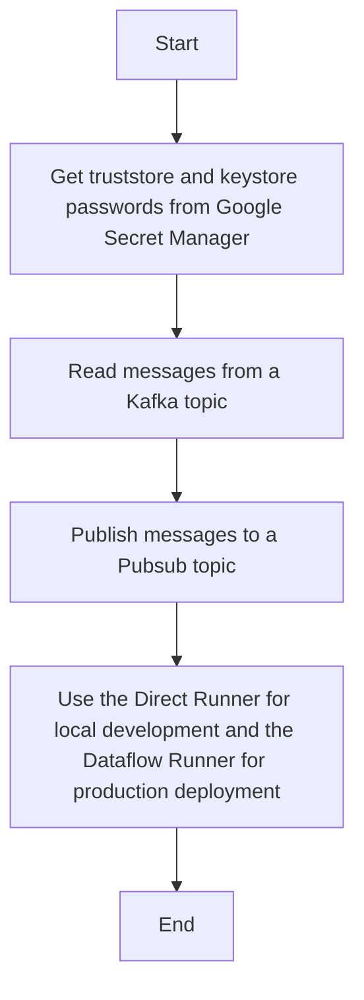

# Kafka2Pubsub
This is a simple Kafka to Pubsub bridge. It reads messages from a Kafka topic and publishes them to a Pubsub topic. Written in Java and Apache Beam, uses the native KafkaIO and PubsubIO connectors, deployed on Google Cloud Dataflow.

## Overall approach
0. Get truststore and keystore passwords from Google Secret Manager.
1. Read messages from a Kafka topic using the KafkaIO connector.
2. Publish messages to a Pubsub topic using the PubsubIO connector.
3. Use the Direct Runner for local development and the Dataflow Runner for production deployment.

Mermaid diagram:


## How to run
### Local development (via Direct Runner)

```bash
BOOTSTRAP_SERVERS=[KAFKA_BOOTSTRAP_SERVERS] # e.g. localhost:9092
TOPIC=[KAFKA_TOPIC] # Kafka topic to read from e.g. my-topic
PUBSUB_TOPIC=[PUBSUB_TOPIC] # Full Pubsub topic path to publish to e.g. projects/my-project/topics/my-topic
TRUSTSTORE_LOCATION=[TRUSTSTORE_LOCATION] # Path to the truststore file (local to the machine / worker)
TRUSTSTORE_PASS_SECRET_ID=[TRUSTSTORE_PASS_SECRET_ID] # Secret Manager secret ID for the truststore password 
KEYSTORE_LOCATION=[KEYSTORE_LOCATION] # Path to the keystore file (local to the machine / worker)
KEYSTORE_PASS_SECRET_ID=[KEYSTORE_PASS_SECRET_ID] # Secret Manager secret ID for the keystore password
SECRET_MANAGER_PROJECT_ID=[SECRET_MANAGER_PROJECT_ID] # GCP project ID where the secrets are stored

mvn compile exec:java \
    -Dexec.mainClass=org.apache.beam.samples.MainPipeline \
    -Dexec.args="--runner=DirectRunner \
        --kafkaBootstrapServers=${BOOTSTRAP_SERVERS} \
        --kafkaTopic=${TOPIC} \
        --pubsubTopic=${PUBSUB_TOPIC} \
        --sslTruststoreLocation=${TRUSTSTORE_LOCATION} \
        --sslTruststorePassSecretId=${TRUSTSTORE_PASS_SECRET_ID} \
        --sslKeystoreLocation=${KEYSTORE_LOCATION} \
        --sslKeystorePassSecretId=${KEYSTORE_PASS_SECRET_ID} \
        --secretManagerProjectId=${SECRET_MANAGER_PROJECT_ID} \
        --sslEndpointIdentificationAlgorithm=" # Optional: e.g. https"
```

### Build on Google Cloud Build

TBD